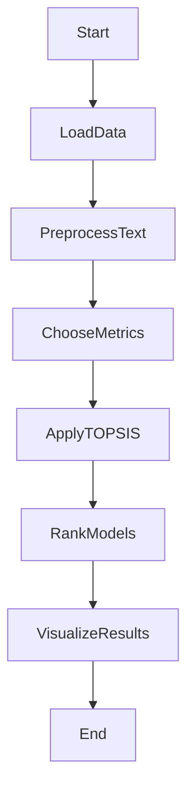

# Text Summarization Model Comparison Project

## Overview

Text summarization is a crucial natural language processing task that involves condensing large documents into concise and informative summaries. This project focuses on comparing the performance of various text summarization models to help users choose the most suitable model for their specific needs.

## Key Features:

1. **Metrics Considered:**
   - The comparison is based on essential metrics, including Rouge scores, length of the summary, and training time. Rouge scores assess the quality of the generated summaries, while length and training time provide insights into efficiency and resource requirements.

2. **Methodology - TOPSIS:**
   - The Technique for Order of Preference by Similarity to Ideal Solution (TOPSIS) method is employed for the comparison. This method considers both the similarity to the ideal solution and the dissimilarity to the negative ideal solution, providing a comprehensive ranking.

3. **Models Evaluated:**
   - Real-world pretrained models, such as BERTSumExt, GPT-3, T5, XLNet, BART, and Pegasus, are included in the comparison. These models are widely used in text summarization tasks.

## Project Structure:

- **`data.csv`**: CSV file containing evaluation metrics for each model.
- **`result.csv`**: CSV file with ranked results in tabular format.
- **`result.csv`**: CSV file with data used for creating a bar chart.
- **`barchart.png`**: Bar chart visualizing the model comparison.

## Analysis:
**Model Performance:**
GPT-3 outperforms other models in terms of Rouge scores, securing the top rank.
BERTSumExt and T5 follow closely, showcasing competitive performance.
Efficiency Consideration:
BERTSumExt is the most resource-efficient, with the lowest training time.
BART and T5 offer a balanced trade-off between Rouge scores and efficiency.
Next Steps:
Feel free to analyze the provided CSV files for more insights.
Consider adjusting the evaluation metrics or adding new models based on your specific use case.
Use the project as a foundation for ongoing research and development in text summarization.

